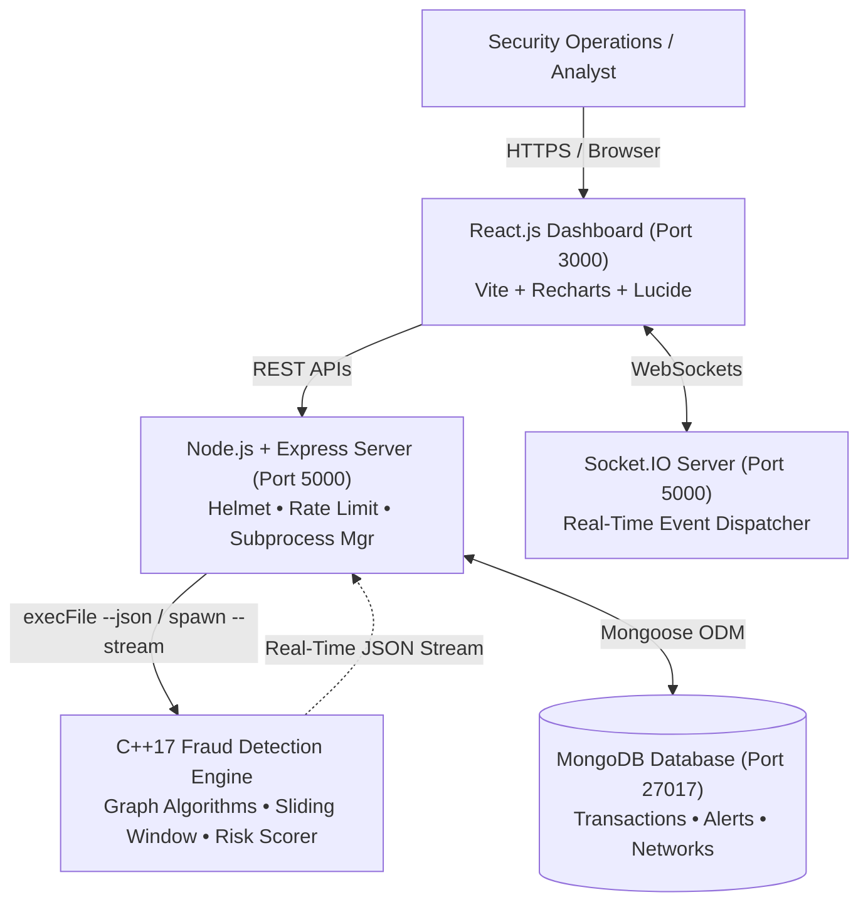

# Fraud Detection & Transaction Risk Dashboard

> Real-time fraud detection and transaction risk dashboard powered by a C++ DSA-based detection engine, Node.js, React, MongoDB, and WebSockets.

[](https://en.cppreference.com/w/cpp/17)
[](https://nodejs.org/)
[](https://expressjs.com/)
[](https://react.dev/)
[](https://www.mongodb.com/)
[](https://www.docker.com/)
[](https://opensource.org/licenses/MIT)

---

## Executive Overview

Modern financial systems process millions of transactions daily, making rule-based and graph-theoretic anomaly detection critical for identifying financial fraud in milliseconds. The **Fraud Detection & Transaction Risk Dashboard** is an enterprise-grade full-stack security platform that combines the raw computational throughput of **native C++17** with a modern **Node.js + Express** orchestration layer, persistent **MongoDB** storage, and an interactive real-time **React.js** dashboard.

The core fraud detection logic is implemented entirely in C++ using fundamental Data Structures and Algorithms (DSA) without relying on black-box machine learning libraries, guaranteeing absolute deterministic transparency, low latency, and auditability.

---

## Architecture

### System Topology



### Internal C++ Detection Pipeline

```
Incoming Banking Transactions (1,000+ Batch / Real-Time Continuous Stream)
                          │
                          ▼
            Account Hashing & Temporal Indexing
         (std::unordered_map & FIFO std::deque)
                          │
                          ▼
             Sliding Window Velocity Analysis
     (60-Second Rapid Bursts & Multi-Recipient Dispersion)
                          │
                          ▼
             Directed Transaction Graph Construction
         (Sparse Adjacency List: std::unordered_map)
                          │
            ┌─────────────┴─────────────┐
            ▼                           ▼
BFS / DFS Reachability Analysis    Disjoint Set Union (DSU)
  & Directed Cycle Detection     (Weakly Connected Fraud Clusters)
 (Money-Muling Ring Traversal)
            └─────────────┬─────────────┘
                          │
                          ▼
             Multi-Factor Rule-Based Risk Engine
   (Amount Spike + Velocity Burst + Ring Participation)
                          │
                          ▼
           Unified Deduplicated Fraud Alerts
              (Prioritized by Risk Severity)
```

---

## Data Structures & Algorithms (DSA) Breakdown

A primary architectural principle of this system is demonstrating rigorous, professional Data Structures & Algorithms to solve concrete financial crime problems:

| Data Structure / Algorithm | Technical Implementation | Purpose & Rationale |
|---|---|---|
| **Hash Tables (`std::unordered_map`)** | Bucketed hash map with $O(1)$ amortized lookup | Maps account IDs to transaction histories and forms the adjacency list of the transaction graph without dense matrix overhead. |
| **Hash Sets (`std::unordered_set`)** | Hash set with $O(1)$ average insertion & search | Tracks visited vertices during graph traversals and counts distinct transaction recipients within temporal windows. |
| **Double-Ended Queues (`std::deque`)** | Double-ended queue with $O(1)$ amortized push/pop | Implements rolling temporal sliding windows ($W=60\text{s}$). Expired timestamps are pruned from the front in $O(1)$ while new events arrive at the back. |
| **Sliding Window Analysis** | Two-pointer deque queue mechanism | Detects rapid burst velocities ($\ge 5$ transactions in 60s) and rapid multi-recipient asset dispersion before traditional batch systems detect them. |
| **Adjacency Lists** | `unordered_map<string, vector<string>>` | Represents sparse directed transaction flow graphs efficiently ($O(V + E)$ space) avoiding the memory footprint of an $O(V^2)$ adjacency matrix. |
| **Breadth-First Search (BFS)** | Level-order traversal using `std::queue` | Discovers shortest fund transfer hops and tests recipient-to-sender reachability to detect emerging circular paths in $O(V + E)$ time. |
| **Depth-First Search (DFS)** | Recursive call stack traversal | Explores deep money-laundering transfer chains across multi-hop intermediary mule accounts. |
| **Directed Cycle Detection** | 3-Color / Recursion Stack DFS | Identifies closed money-laundering loops ($A \to B \to C \to D \to A$) where illicit capital is routed through mules to return to the originator. |
| **Disjoint Set Union (DSU)** | Path Compression + Union by Rank | Computes connected fraud networks and clusters syndicates in near-linear time ($O(E \cdot \alpha(V))$, where $\alpha$ is the Inverse Ackermann function). |
| **Rule-Based Risk Scoring** | Multi-factor composite heuristic evaluator | Computes a normalized risk score ($0 \le \text{Score} \le 100$) in $O(1)$ per transaction, categorizing events into `LOW`, `MEDIUM`, `HIGH`, or `CRITICAL` risk tiers. |

---

## Algorithmic Complexity

| Operation / Component | Time Complexity | Auxiliary Space Complexity | Real-World Performance |
|---|---|---|---|
| **Account Hash Indexing** | $O(N)$ amortized | $O(N)$ | Sub-millisecond for 10,000+ accounts |
| **Sliding Window Burst Check** | $O(1)$ amortized per transaction | $O(W)$ active window | Instantaneous window eviction |
| **Graph Construction** | $O(E)$ | $O(V + E)$ | Linear in transaction edge count |
| **BFS Reachability** | $O(V + E)$ | $O(V)$ | Evaluated within microseconds |
| **DFS Deep Traversal** | $O(V + E)$ | $O(V)$ recursion stack | Explores complete money trails |
| **Cycle Detection** | $O(V + E)$ | $O(V)$ | Exact detection of mule rings |
| **DSU Component Union** | $O(E \cdot \alpha(V)) \approx O(E)$ | $O(V)$ | Near-linear connected clustering |
| **Risk Scoring & Classification**| $O(1)$ | $O(1)$ | Zero runtime overhead |
| **Alert Prioritization** | $O(M \log M)$ ($M \le N$) | $O(1)$ auxiliary | Fast sorting of flagged incidents |
| **MongoDB Indexed Lookups** | $O(\log K + M)$ | $O(1)$ RAM working set | B-Tree index scan on `transactionId`/`timestamp` |

---

## Key Features

1. **Deterministic Rule-Based Detection Core**:
   - Zero hallucinations or black-box predictions; every alert contains concrete audit reasons (e.g., *"Rapid transaction burst"*, *"Circular transaction flow"*, *"High transaction amount"*).
2. **Real-Time Telemetry & Streaming**:
   - Continuous transaction streaming simulation via C++ `--stream` at ~1.5s intervals with automatic fraud scenario injection.
   - Line-buffered standard output streaming communicating directly with Node.js child processes.
3. **Reactive WebSocket Broadcast**:
   - Instant bi-directional WebSocket delivery via Socket.IO for transactions, critical fraud alerts, rolling analytics, and network updates.
4. **Historical Ledger & Audit Trail**:
   - Persistent MongoDB storage using Mongoose schemas.
   - Multi-attribute query filtering (`startDate`, `endDate`, `riskLevel`, `status`, `sender`, `receiver`, `search`).
   - Deep inspection modal with complete parameter breakdown.
5. **Top Suspicious Accounts Leaderboard**:
   - Aggregation pipeline identifying high-frequency anomaly generators, peak risk scores, and primary fraud patterns.
6. **Network & Topological Visualization**:
   - Visual inspection of directed money-muling rings and connected fraud components discovered via DFS and DSU.
7. **Resilient Production Architecture**:
   - Non-blocking database connection: falls back seamlessly to in-memory caching if MongoDB is temporarily unavailable.
   - Helmet security headers and rate-limiting middleware to guard against abuse.
   - Clean signal handling (`SIGINT`, `SIGTERM`) with zero orphaned subprocesses.

---

## Tech Stack

- **Core Engine**: C++17, CMake, GCC / MinGW, POSIX Threads
- **Backend API**: Node.js 20, Express.js 4, Socket.IO 4, Mongoose 8, Helmet, Express-Rate-Limit
- **Database**: MongoDB 7.0
- **Frontend UI**: React 18, Vite 5, Recharts, Lucide React, Axios
- **DevOps & Containers**: Docker, Docker Compose, Nginx

---

## REST API Reference

| Method | Endpoint | Description |
|---|---|---|
| `GET` | `/api/health` | Service health probe (`backend`, `database`, `monitoring`, `engine`, `uptime`) |
| `POST` | `/api/analyze` | Triggers C++ batch engine (`--json`), persists results to MongoDB with upsert deduplication |
| `GET` | `/api/transactions` | Paginated transactions with multi-attribute filters (`page`, `limit`, `riskLevel`, `status`, `search`, etc.) |
| `GET` | `/api/transactions/:id` | Full inspection audit record for an individual transaction |
| `GET` | `/api/alerts` | Prioritized fraud alerts filtered by risk tier (`CRITICAL`, `HIGH`, `MEDIUM`, `LOW`) |
| `GET` | `/api/analytics` | Summary metrics: total transactions, risk tier counts, average risk score, and highest risk score |
| `GET` | `/api/analytics/suspicious-accounts`| Top suspicious accounts leaderboard aggregated by alert frequency and peak severity |
| `GET` | `/api/networks` | Graph clusters and detected circular transaction loops |
| `GET` | `/api/monitoring/status` | Current real-time stream status, subprocess PID, and emitted transaction count |
| `POST` | `/api/monitoring/start` | Starts continuous C++ real-time streaming subprocess (`--stream`) |
| `POST` | `/api/monitoring/stop` | Terminates streaming subprocess cleanly without orphans |

---

## Real-Time WebSocket Events (Socket.IO)

| Event Name | Direction | Payload Description |
|---|---|---|
| `monitoring:status` | Server $\to$ Client | Live monitoring state: `{ running: boolean, pid: number, uptime: number, transactionsEmitted: number }` |
| `transaction:update` | Server $\to$ Client | Real-time transaction record with risk score, tier, and alert reasons |
| `fraud:alert` | Server $\to$ Client | High-priority alert triggered when a transaction risk score exceeds 30 |
| `analytics:update` | Server $\to$ Client | Dynamically recalculated KPI summary metrics |
| `network:update` | Server $\to$ Client | Graph ring update when an edge completes a circular laundering loop |

---

## Local Installation & Setup

### Prerequisites
- **C++ Compiler**: GCC 9+ / Clang 10+ / MinGW with C++17 support
- **Node.js**: v18.x or v20.x (with npm)
- **MongoDB**: (Optional) v6.0+ local instance or Docker. If not installed, the backend automatically runs in resilient in-memory caching fallback mode.

### Step 1: Clone Repository
```bash
git clone https://github.com/manav-parashar26/Fraud-Detection-Transaction-Risk-Dashboard.git
cd Fraud-Detection-Transaction-Risk-Dashboard
```

### Step 2: Build C++ Fraud Engine
```bash
# Using CMake (Recommended across Linux & Windows)
cd FraudDetectionDashboard/fraud-engine
cmake -B build
cmake --build build --config Release

# Alternatively using direct g++:
# Windows (PowerShell):
g++ -std=c++17 -Wall -Wextra -Iinclude src/main.cpp src/TransactionGenerator.cpp src/FraudInjector.cpp src/FraudDetector.cpp src/TransactionGraph.cpp src/DSU.cpp src/RiskScorer.cpp src/JsonSerializer.cpp src/StreamSimulator.cpp -o fraud_engine.exe

# Linux / macOS:
g++ -std=c++17 -Wall -Wextra -pthread -Iinclude src/main.cpp src/TransactionGenerator.cpp src/FraudInjector.cpp src/FraudDetector.cpp src/TransactionGraph.cpp src/DSU.cpp src/RiskScorer.cpp src/JsonSerializer.cpp src/StreamSimulator.cpp -o fraud_engine
```

### Step 3: Install & Start Backend
```bash
cd ../backend
npm install
npm run dev
```
*Runs on `http://localhost:5000` (Health Check: `http://localhost:5000/api/health`)*

### Step 4: Install & Start Frontend
```bash
cd ../frontend
npm install
npm run dev
```
*Accessible in browser at `http://localhost:3000`*

---

## Docker Deployment (Production)

To deploy the containerized full-stack platform using Docker Compose:

```bash
cd FraudDetectionDashboard
docker-compose up --build -d
```

### Containers Created:
1. **`fraud_mongodb`**: Official MongoDB 7 with volume persistence (`mongodb_data`) and automatic health check ping.
2. **`fraud_backend`**: Multi-stage Linux container compiling the C++17 engine with `g++ -O3 -pthread` and running Express + Socket.IO on port 5000.
3. **`fraud_frontend`**: Multi-stage container compiling the Vite production bundle and serving it via Nginx on port 3000 with reverse proxying for `/api` and WebSockets.

To stop the containers:
```bash
docker-compose down
```

---

## Environment Configuration

Copy `.env.example` to `.env` in the respective directory:

| Variable | Scope | Default Value | Description |
|---|---|---|---|
| `PORT` | Backend | `5000` | HTTP and WebSocket server listening port |
| `NODE_ENV` | Backend | `development` | Runtime mode (`development` / `production`) |
| `MONGO_URI` | Backend | `mongodb://localhost:27017/fraud_detection` | MongoDB connection URI (also supports `MONGODB_URI`) |
| `CORS_ORIGIN` | Backend | `http://localhost:3000,http://127.0.0.1:3000` | Whitelisted frontend origins for CORS protection |
| `FRONTEND_URL` | Backend | `http://localhost:3000` | Canonical frontend address |
| `CPP_ENGINE_PATH` | Backend | *(Auto-detected)* | Explicit path to compiled C++ `fraud_engine` executable |
| `VITE_API_URL` | Frontend | `http://localhost:5000/api` | Base URL for REST API requests |
| `VITE_SOCKET_URL`| Frontend | `http://localhost:5000` | Server URL for WebSocket connection |

---

## Verification & Automated Testing

The project includes automated verification test suites:

```bash
# 1. API, Health & Subprocess Resilience Test Suite (20 Tests)
npm test

# 2. Database Persistence, Aggregations & Deduplication Test Suite (12 Tests)
npm run test:db

# 3. Production Frontend Bundle Compilation
npm run build:frontend
```

---

## Screenshots

<!-- Visual demonstration placeholders for repository showcase -->
| Executive Risk Dashboard | Live Operations Console |
|:---:|:---:|
|  |  |

| Topological Fraud Networks | Historical Transaction Ledger |
|:---:|:---:|
|  |  |

---

## Future Improvements

- **Machine Learning Integration**: Complementing rule-based weights with Isolation Forests and Autoencoders for unsupervised novelty detection.
- **Distributed Stream Processing**: Ingesting high-volume transaction telemetry via Apache Kafka or RabbitMQ clusters.
- **Role-Based Access Control (RBAC)**: Enterprise authentication via JWT and OAuth2 for Fraud Analyst vs. Compliance Auditor roles.
- **Interactive 3D Network Graph**: Enhanced WebGL force-directed graph visualizer using Three.js / React Flow for multi-thousand node visualization.

---

## License

This project is licensed under the MIT License — see the [LICENSE](LICENSE) file for details.
